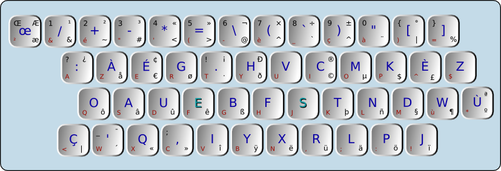

# Clavier dvorak-fr, version Mouette



La disposition ci-dessous est une adaptation de la disposition de clavier Dvorak pour la langue française. Plusieurs variantes sous disponibles, notamment une proposée par Josselin Mouette, que j'utilise depuis 2006.

Cette version était fournie avec X.org mais ne l'est plus depuis quelques années. Pour ma part j'utilise toujours cette disposition au quotidien. Je n'ai pas vraiment envie d'apprendre une nouvelle variante comme BÉPO; aussi, j'ai réuni ici pour mon usage personnel les fichiers nécessaires à l'installation de cette disposition pour Windows, Linux et Darwin (Mac OS).

- Sous Darwin, il suffit de déplacer les fichiers `dv-fr.icns` (pour un joli drapeau!) et `dv-fr.keylayout` dans le dossier `~/Library/Keyboard Layouts` ou mieux, dans `/Library/Keyboard Layouts`, sous réserve d'avoir les permissions.

- Sous Linux, le contenu du fichier fourni est compatible avec le format xmodmap. J'ai pris l'habitude d'écraser le contenu de `/usr/share/X11/xkb/symbols/fr`.

- Sous Windows, le fichier `dv-fr.klc` est compatible avec le Microsoft Keyboard Layout Creator, qui produit les exécutables du même dossier. L'installation se fait simplement via l'exécutable `setup.exe`.

## swap-caps

J'ai pris également pour habitude d'utiliser la touche de verrouillage numérique (caps-lock) comme une touche Ctrl supplémentaire. Les manipulations pour parvenir à ce mode de fonctionnement sont indépendantes de la disposition du clavier.

- Sous Darwin, l'option se situe dans Préférences Systèmes, Clavier, Touches de modification

- Sous Linux, la commande idoine est `setxkbmap -option ctrl:nocaps`.

- Sous Windows, utiliser `regedit` pour créer une clé de type binaire nommée `Scancode Map` dans `HKEY_LOCAL_MACHINE\System\CurrentControlSet\Control\KeyBoard Layout` avec le contenu suivant:
```
    0000  00 00 00 00 00 00 00 00
    0008  02 00 00 00 1d 00 3a 00
    0010  00 00 00 00
```
On peut aussi automatiser la procédure avec le script `nocaps.reg` fourni.

